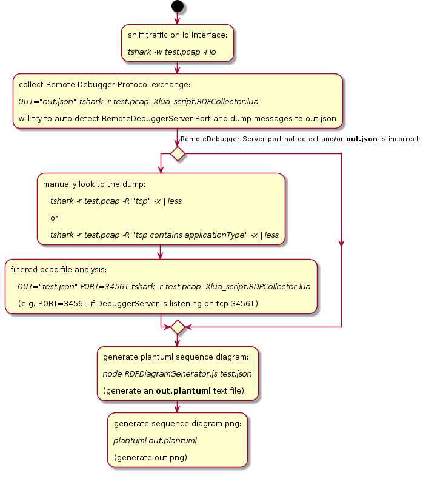
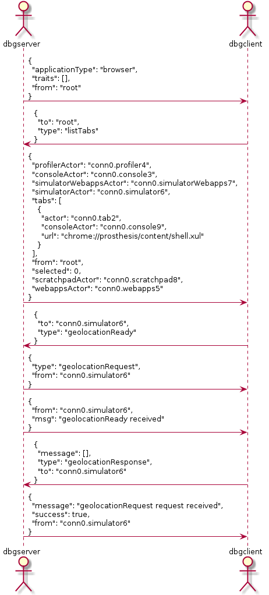
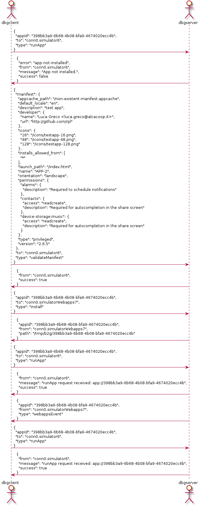
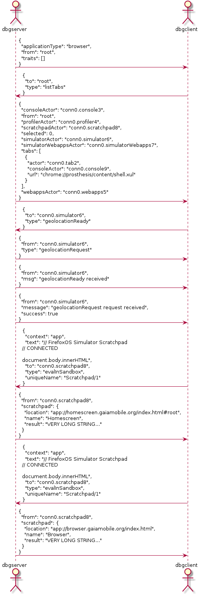

Mozilla RemoreDebuggerProtocol - Wireshark Plugins
==================================================

Status: **PROOF OF CONCEPT**

Into this repository I'm collecting some experimentation on automated UML Sequence Diagrams generation
from a sniffed pcap file to better visualize messages exchanged by Remote Debugger Protocol
actors and clients (e.g. Browser Debugger, FirefoxOS Simulator Addon etc.)

This could be useful for a number of reasons:
- documenting the protocol and its use in the various Mozilla Remote Developer Tools
- visualize message exchange during prototyping/development
- plan changes on messages exchanged by an existent actor & client

Currently it's just a proof of concept (it's probably not fully completed and/or correct)
but it's already usable & useful to generate simple diagrams from saved pcap files.

Dependencies
------------

- tshark (tested version 1.8.2)
- nodejs (tested version 0.8.15)
- [plantuml (tested version 7965)](http://sourceforge.net/projects/plantuml/files/plantuml.jar/download)

How it works
------------



Examples: Generated Diagrams
----------------------------

```
make examples
...
cat Makefile
examples: examples/01-simulator-start.png examples/02-simulator-install-app.png examples/03-longStrings-simulator-remoteScratchpadPrototype.png

%.json: %.pcap
	OUT="$@" tshark -r $< -Xlua_script:RDPCollector.lua > /dev/null

%.png: %.json
	node RDPDiagramGenerator.js $< out.plantuml $@
	plantuml out.plantuml
	rm out.plantuml
```

### 01 - Simulator Start



### 02 - Simulator Install App



### 03 - Long Strings Example (Simulator remoteScratchpad prototype)


